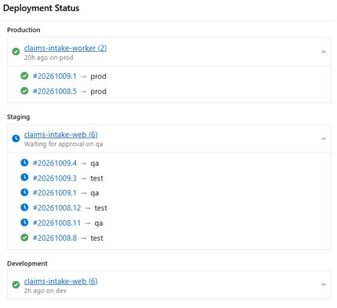
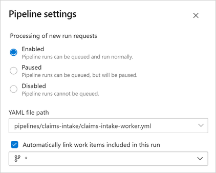
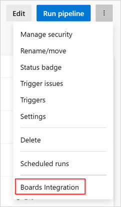
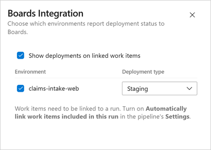
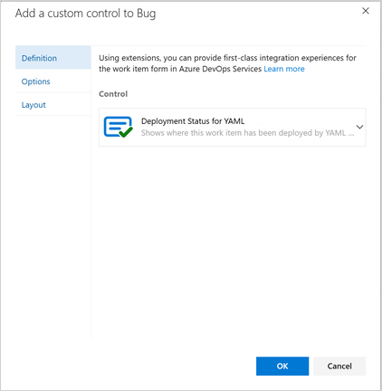
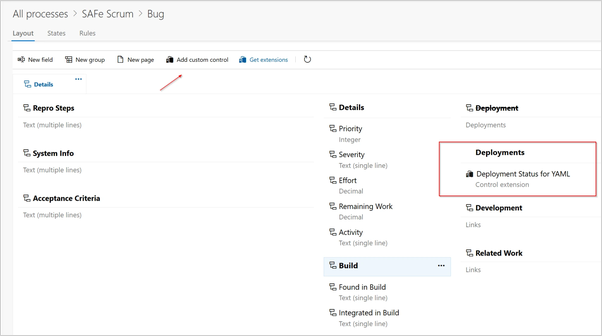

# Deployment Status to Boards for YAML

This extension brings the Classic release pipeline feature [Automatically link work items to releases and report deployment status to a work item](https://learn.microsoft.com/en-us/azure/devops/pipelines/integrations/configure-pipelines-work-tracking#classic-report-boards) to YAML pipelines that deploy to Azure DevOps environments.

The Azure DevOps team has this feature on the [roadmap](https://learn.microsoft.com/en-us/azure/devops/release-notes/roadmap/2024/boards-yaml-stage-status-on-work-item). This extension should be considered as a temporary workaround until it is released.

The extension adds a custom control to Azure Boards work item forms that displays deployment status for YAML pipelines. It uses the same style as the classic Deployment control. But instead of using Integrated in release stage links, it finds the work item's runs and displays their [Deployment Jobs](https://learn.microsoft.com/en-us/azure/devops/pipelines/process/deployment-jobs?view=azure-devops) targeting Environments.

Runs are found in two ways:

- Completed runs: the work item's Integrated in build links.
- Runs in progress: runs of the repositories in the work item's commit and pull request links (Azure Repos) that include the work item. These are the runs that get the Integrated in build link when they complete.

A stage waiting for an approval is shown as Waiting for approval, in the environment it last deployed to.

The extension does not write data to work items; it only reads existing links. Uninstalling it will not affect your work items or any existing data.

## Get started

> Note: During initial testing, the extension is behind a preview feature. Open User settings > Preview features and turn on Deployment Status to Boards for YAML.

### 1. Enable automatic work item linking

In your pipeline, open Settings and turn on Automatically link work items included in this run. This is what creates the Integrated in build links on the work items.

### 2. Configure Boards Integration

In pipeline menu, open ⋯ > Boards Integration.

Choose a deployment type for each environment.

### 3. Add the new control to your work item forms

Open Organization settings > Process and select your process. For each work item type where you want deployment status displayed, open Layout.

Add a new Deployment group, in the same column.

Add the Deployment Status for YAML custom control to the group.

If not needed for classic release pipelines, Hide the built-in Deployment section.

## Permissions and privacy

This extension requires read-only access to work items and builds. No data leaves your Azure DevOps organization. See [PRIVACY.md](https://github.com/excelery/azdo-extension-deployment-status/blob/main/PRIVACY.md).

## Support

Report bugs and request features through [GitHub Issues](https://github.com/excelery/azdo-extension-deployment-status/issues). Please check existing issues before opening a new one.

To report a vulnerability, follow [SECURITY.md](https://github.com/excelery/azdo-extension-deployment-status/blob/main/SECURITY.md).

## Contributing

See [CONTRIBUTING.md](https://github.com/excelery/azdo-extension-deployment-status/blob/main/CONTRIBUTING.md) for contribution guidelines.

